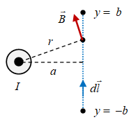

Terdapat sebuah kawat lurus panjang yang mengalirkan arus $I$ keluar dari bidang gambar menuju pembaca. Suatu lintasan garis lurus dari $y = -a$ sampai $y = a$ terletak pada jarak $a$ dari kawat tersebut, sebagaimana diberikan dalam gambar di bawah ini.







Ingin dihitung $\int \vec{B} \cdot d\vec{l}$ menggunakan lintasan garis lurus tersebut.

Dengan mengggunakan bantuan gambar sebelumnya dapat diperoleh solusi dari

\begin{equation}\nonumber
\int \frac{a dy}{a^2 + y^2},
\end{equation}

yaitu

<ol type="A">
<li>$\tan y + c$.
<li>$\tan^{-1} y + c$.
<li>$\tan (y/a) + c$.
<li>$\tan^{-1} (y/a) + c$.
<li>$\tan^{-1}(a/y) + c$.


\begin{eqnarray}
y = a \tan \theta \newline
dy = a \sec^2 \theta \ d\theta \newline
a^2 + y^2 = a^2 \sec^2 \theta \newline
\displaystyle \int \frac{a dy}{a^2 + y^2} = \int \frac{a (a\sec^2 \theta \ d\theta)}{a^2 \sec^2 \theta} = \int d\theta = \theta = \tan^{-1} \left(\frac{y}{a}\right) + c
\end{eqnarray}

